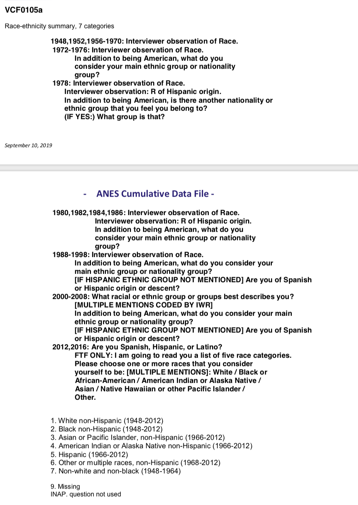
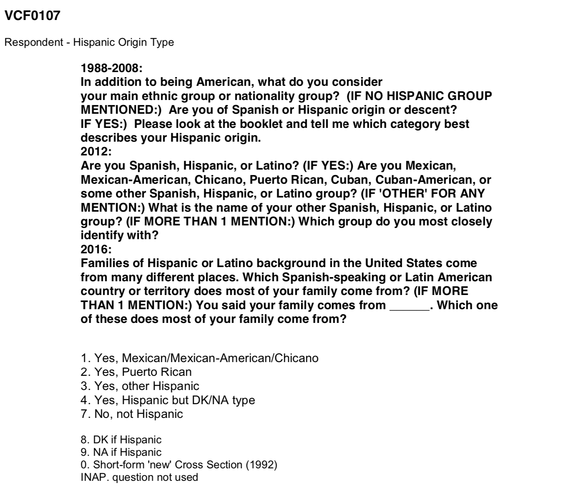
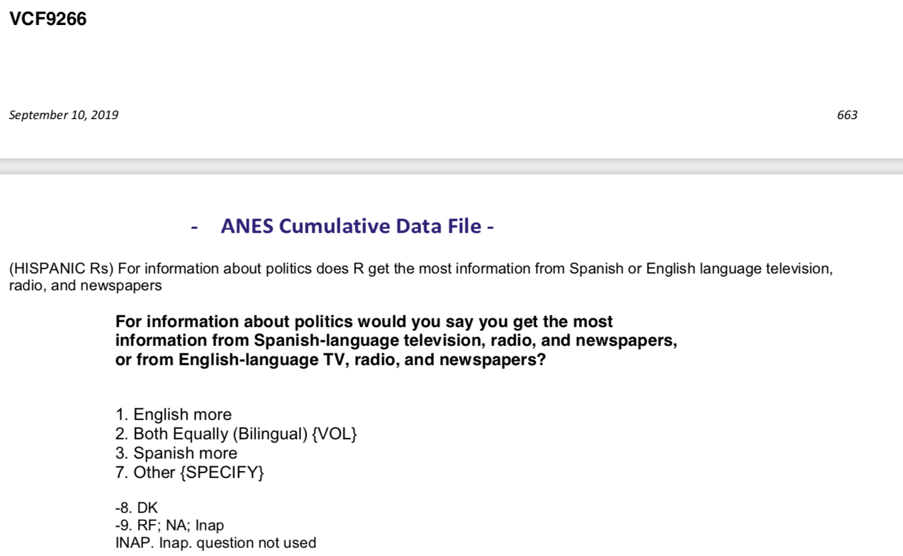
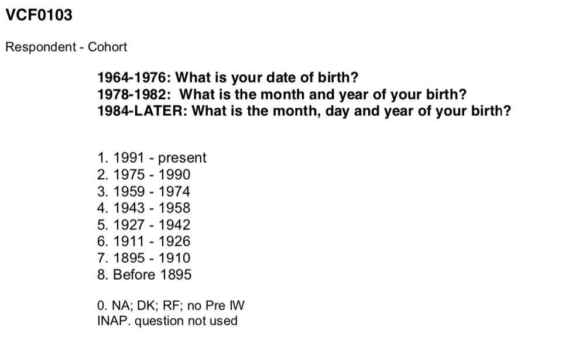
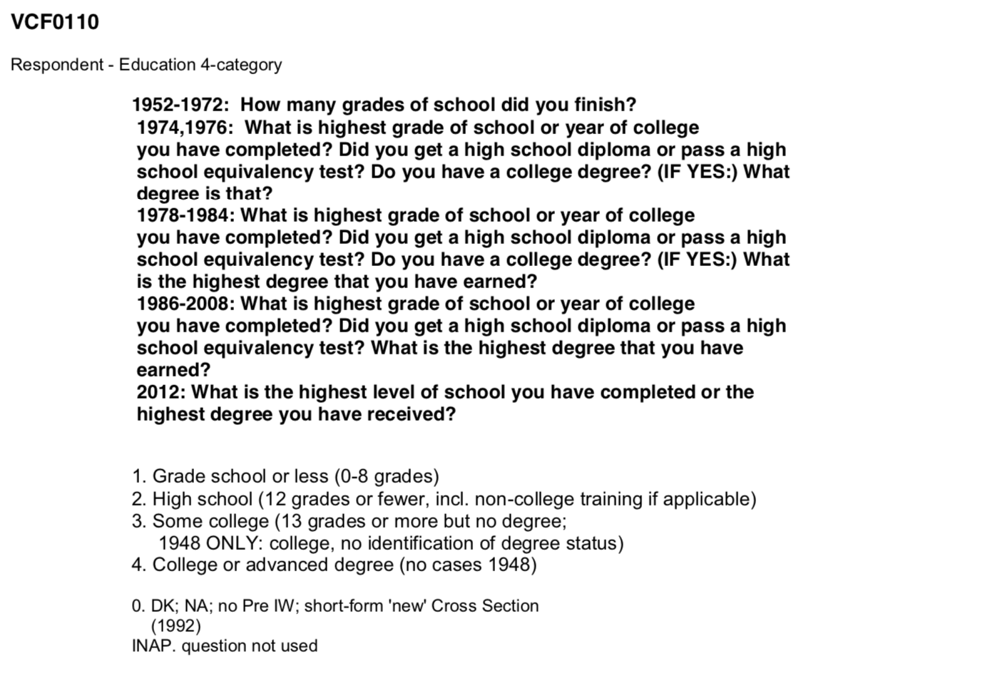
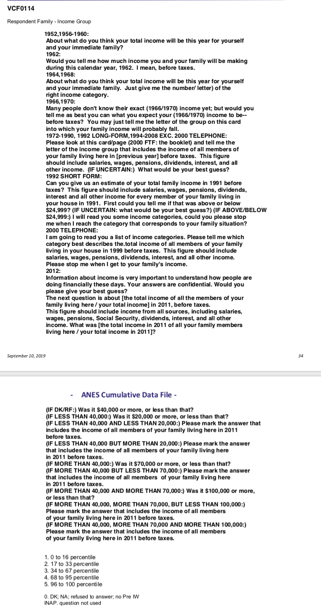
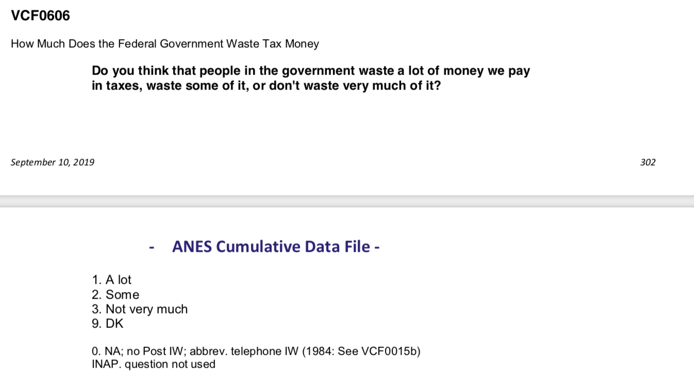

[For the 2020 election](https://www.businessinsider.com/bidens-election-chances-with-hispanic-voters-in-texas-florida-arizona-2020-9), Latios' civic engagement is especially important. It is the first time that Latinos are projected to be the largest racial minority in a US presidential election, with a record of 32 million eligible to vote, accounting for 13.3% of the total eligible voters. They constitute a big part of the voting population in the swing states, with 30% in Texas, 24% in Arizona, and 20% in Florida. Those swing states are crucial for President Trump to win to secure the White House. Also, Latino voters tend to cast their ballots early and by mail in 2018, which are two keys methods for voting this year due to the pandemic that is going on.

As Latino voters are increasingly important over the years, in this project, I am going to look at how Hispanics' voting enthusiasm has changed over time and what drives their decisions. As [Hispanic](https://en.wikipedia.org/wiki/Hispanic) refers to people with a historical and cultural relationship with Spain, it would be interesting to see if cultural identity (race-ethnicity & language) and some other demographic factors(age, education, income (and tax attitude), etc) affect their voting choices. 

To look at this, I used *American National Election Studies Time Series Cumulative Data file 1948-2016*. The *American National Election Studies* (ANES) are surveys of voters in the U.S. on the national scale. For each presidential election since 1948, ANES collects responses from respondents both before and after the election. The goal of ANES is to understand electoral behavior, political participation and public opinion.The *Time Series Cumulative Data* of ANES include answers, from respondents from different years, on selected questions that have been asked in three or more ANES' *Time Series* studies.A tremendous amount of effort has been put into data consolidation as variables are often named differently in different years. 


```{r load libraries, warning=FALSE, message=FALSE, include=FALSE}
# Checking `R` packages for data processing
packages.used=as.list(
  c(
  "tidyverse",
  "haven",
  "devtools",
  "RColorBrewer",
  "data.table",
  "ggplot2",
  "plotly")
)

check.pkg = function(x){
  if(!require(x, character.only=T)) install.packages(x, 
                                                     character.only=T,
                                                     dependence=T)
}

lapply(packages.used, check.pkg)
```

```{r read in data, message = F,include=FALSE}
# Import raw ANES data
library(haven)
anes_dat <- read_sav("../data/anes_timeseries_cdf.sav")
```

```{r labelled variables subset, include=FALSE}
# Data Preprocessing
Election_years=as.character(seq(1952, 2016, 4))

anes_use=anes_dat%>%
  mutate(
    year=as_factor(VCF0004),
    participation=as_factor(VCF0703),
    vote=as_factor(VCF0706),
    race=as_factor(VCF0105a),
    gender=as_factor(VCF0104),
    Hispanic_Origin=as_factor(VCF0107),
    year_of_birth = as_factor(VCF0103),
    education = as_factor(VCF0110),
    information_language = as_factor(VCF9266),
    income_group = as_factor(VCF0114),
    tax_attitude = as_factor(VCF0606))%>%
  filter(year %in% Election_years)

library(data.table)

data.table(anes_use%>%
             select(year, participation, vote,race,gender,Hispanic_Origin,year_of_birth,education,information_language,income_group,tax_attitude)%>%
             filter(!is.na(participation))%>%
             sample_n(30))


anes_use = anes_use%>%select(year, participation, vote, race, gender,Hispanic_Origin,year_of_birth,education,information_language,income_group,tax_attitude)

save(anes_use, file="../output/data_use.RData")
```

Before dive right into it, one [KEY NOTE](https://www.pewresearch.org/fact-tank/2020/09/15/who-is-hispanic/) is that many sources (such as Census Bureau and our ANES dataset) do not draw the different between Hispanic and Latino, and they use Latino and Hispanic interchangeably For those who draw the difference between the two, one  of the common ways is that Hispanics are people who are from Spain or Spanish-speaking countries (which excludes Brazil), and Latinos are people from Latin America regardless of the language(which includes Brazil but excludes Spain) 


### How to identify Hisipanic Voters? 
To look at the Hispanic voters' behavior, we need first to define the race-ethnicity group. I used VCF0105a as the variable for race-ethnicity (see below). Although there is another variable (VCF0105b) measures race-ethnicity, as it has only 4 categories and also 3942 people identified as Hispanic, I chose VCF0105a:



```{r For Race}
summary(as.factor(anes_dat$VCF0105b))
summary(as.factor(anes_dat$VCF0105a))
```
One thing to note is that before  1998, the interviewer observes race instead of asking. Beginning in 1988, the respondent was asked within the series of ethnicity questions for self-identification. So this could potentially introduce bias, as the interviewer could have stereotypical view on ethnicity.

So, after I identified the Hispanic voters, I looked at their voting participation. Even though it would be interesting to look at the turnout rate, as I do not have the number of eligible Hispanic voters, I just looked at the change of register and voting over the year.


```{r Hispanic Turnout, echo = FALSE}
anes_Hispanic_participation = anes_use %>%
  filter(race == "5. Hispanic (1966-2012)") %>%
  group_by(year)%>%
  count(participation)%>%
  mutate(prop=n/sum(n))
#anes_Hispanic_participation

ggplot(anes_Hispanic_participation, 
       aes(x=year, y=n, fill=participation)) +
  geom_bar(stat="identity", colour="white")+ 
  scale_fill_manual(values=c("burlywood1", "burlywood2", "burlywood3", "grey84"))+
  theme(axis.text.x = element_text(angle = 90))+
  theme(plot.margin = margin(0.3,0.3,0.3,0.3,"cm"))+
  labs(title="Count of Hispanic Voter Participation Over the Years")+
  ylab("Count")
```

In general, the number of Hispanic respondents increased over the years from 16 in 1968 to 219 in 1992, followed by a decreasing trend until the year of 2004, with 114 responpondents surveyed. Then, There is a historical jump in the year of 2008, with 523 people being survey and the number almosted doubled in 2008, with 1,009 people surveyed. Such number droped again in 2016. 

When looking at the number breakdown, we can see that every year more than half of the respondents voted. I am curious to see which political party did they vote for over the years, and comparing them to other race. 

```{r Who did hispanics vote for, echo = FALSE}
anes_vote_race_year_Hispanic = anes_use %>%
  filter(!is.na(race) & !is.na(vote))%>%
  filter(vote!="7. Did not vote or voted but not for president (exc.1972)")%>%
  filter(race == "5. Hispanic (1966-2012)") %>%
  group_by(year)%>%
  count(vote)%>%
  mutate(prop=n/sum(n))

#anes_vote_race_year_Hispanic

ggplot(anes_vote_race_year_Hispanic, 
       aes(x=year, y=n, fill=vote)) +
  geom_bar(stat="identity", colour="white")+ 
  scale_fill_manual(values=c("skyblue2", "lightcoral",  "lightgoldenrod1","ivory2"))+
  theme(axis.text.x = element_text(angle = 90))+
  labs(title="Number of Hispanic Voters Over the Years \n and Who did they vote for")


ggplot(anes_vote_race_year_Hispanic, 
       aes(x=year, y=prop, fill=vote)) +
  geom_bar(stat="identity", colour="white")+ 
  scale_fill_manual(values=c("skyblue2", "lightcoral",  "lightgoldenrod1","ivory2"))+
  theme(axis.text.x = element_text(angle = 90))+
  labs(title="Who did Hispanics vote for in the election \n over the years?")
```

From the graphs, we can see that at the start of the survey, only 5 Hispanics voted, with 60% of them voted for Republican. Up till 1992, more and more Hispanic voters voted, and most of them voted for Democrat. However, there is a decreasing amount of people voted till 2004, with from 2000 - 2004, nearly half of the voters voted for republican. 

What is noticeable is that there is a historical jump in the voter turnout in 2008, with 4.6x the number compared to 2004, with 295 voted and 75.6% voted for democrats. What's more, the number of voters even doubled in 2012, culminated in 628 voters with 71.5% of them voted for Democrat. However, the number of voters decreased in 2016, even though 70% of them still voted for Democrat.

In this study, I am going to focus on the year range from 2000 - 2016. One reason is that there are fewer Hispanics voted before, second is that from 2000, there are almost half of the people voted for Republicans, but after 2000, even though more people voted, 70% of them voted for Democrats. 

```{r Reprocess of data to select year 2000 to 2016, echo = FALSE}
anes_Hispanic = anes_use %>%
  filter(!is.na(race) & !is.na(vote))%>%
  filter(vote!="7. Did not vote or voted but not for president (exc.1972)")%>%
  filter(race == "5. Hispanic (1966-2012)")%>%
  filter(year=="2000"|year=="2004"|year=="2008"|year=="2012"|year=="2016")
```

In order to understand the Hispanic voter behavior in the year of 2000 to 2016, I look at some basic demographics of Hispanic voters. The first demographic variable I am interested in is the birth place of the Hispanic voters. The question and answer scale are shown below: 



Notice that there is aswer for not hispanic and NA. Even though I already selected Hispanic as my study group in the previous question, I still wanted to doouble check ifI defined the Hispanic group correctly.

When first look at this data, what stood out to me is that for 10 people who previously self-identified as Hispanic in the questions "What racial or ethnic group best describes you" are now identified as not Hispanic. At the start of 2000, for the questions related to race and ethnicity, the respondents identified themselves instead of interviewers observation of race. So I think one of the potential reasons why this happens is that this study fails to differentiate between Latino and Hispanic. As in the previous race and ethnicity identification question, there is not a choice of Latino, those who are from Brazil, for example, could categorize them as Hispanic in the previous question but identified as not Hispanic in this question. Also, most of these people tend to be female, with high education and above medium level income.

```{r data_quality_check,echo = FALSE}
data_quality_check = anes_Hispanic %>%
  filter(Hispanic_Origin=="7. No, not Hispanic" | Hispanic_Origin== NA)
data_quality_check
```
There are also two people who did not respond to this question. To avoid the confusion, I dropped those who identified as Not Hispanic and NA from the analysis in the rest of the project.

```{r drop the respondents who has confusing identification, echo = FALSE}
anes_Hispanic= anes_Hispanic %>%
  filter(Hispanic_Origin!="7. No, not Hispanic" | !is.na(Hispanic_Origin))
```

## Culture Identity
#### Q1: Who did Hispanics with different birthplace vote for in the election? 
```{r Who did Hispanics with different birthplace vote for in the election over the years,echo = FALSE}
anes_Hispanic_origin = anes_Hispanic %>%
  group_by(Hispanic_Origin)%>%
  count(vote)%>%
  mutate(prop=n/sum(n))
# anes_Hispanic_origin
# Who did Hispanics with different birthplace vote for in the election over the years? - count
ggplot(anes_Hispanic_origin, 
       aes(x=Hispanic_Origin, y=n, fill=vote)) +
  geom_bar(stat="identity", colour="white")+ 
  scale_fill_manual(values=c("skyblue2", "lightcoral",  "lightgoldenrod1","ivory2"))+
  theme(axis.text.x = element_text(angle = 90))+
  labs(title="Figure 1.1: Hispanics Political Party Preference \n With Different Birthplace")

# Who did Different Education Group Hispanics vote for in the election over the years - count
anes_Hispanic_origin_trend = anes_Hispanic %>%
  group_by(year,Hispanic_Origin)%>%
  count(vote)

ggplot(anes_Hispanic_origin_trend, aes(year,n,fill=vote)) +
  facet_wrap(~Hispanic_Origin, scales = 'free_x') +
  geom_bar(stat="identity", colour="white")+
  scale_fill_manual(values=c("skyblue2", "lightcoral",  "lightgoldenrod1","ivory2"))+
  labs(title="Figure 1.2: Hispanics Political Party Preference By \n Birthplace")+
  theme(plot.margin = margin(0,0,0,0,"cm"),legend.text=element_text(size = 6),axis.text=element_text(size = 6),strip.text=element_text(size=7))

```

Among all groups, they all have increasing participation till 2012 and decrease in 2016. Comparatively,  Mexican-American is the most active voters over the years, and they constitute approximately 60% of the Hispanic votes every year. Starting 2008, around 70%+ of Mexican-American and Puerto Rican voted for Democrats. However, only around 60 of other Hispanics voted for Democrats. 

### Q2: Who did Hispanics with different information news source vote for in the election
After looking at birthplace, another cultural identity factor that comes into my mind is the language. In the context of voting behavior, I am interested in looking at if information news source language would affect the political party preference. The survey and answer scale shown below:



```{r Who did Hispanics with different information news source vote for in the election over the years,echo = FALSE}
anes_Hispanic_information_language = anes_Hispanic %>%
  filter(!is.na(information_language))%>%
  group_by(information_language)%>%
  count(vote)%>%
  mutate(prop=n/sum(n))

# Who did Hispanics with different information news source vote for in the election? - count
ggplot(anes_Hispanic_information_language, 
       aes(x=information_language, y=n, fill=vote)) +
  geom_bar(stat="identity", colour="white")+ 
  scale_fill_manual(values=c("skyblue2", "lightcoral",  "lightgoldenrod1","ivory2"))+
  theme(axis.text.x = element_text(angle = 90))+
  labs(title="Figure 2.1 Who did Hispanics with different birthplace vote for in the election?")

# Who did Hispanics with different information news source vote for  \n in the election over the years? - trend
anes_Hispanic_information_language_trend = anes_Hispanic %>%
  filter(!is.na(information_language))%>%
  group_by(year,information_language)%>%
  count(vote)%>%
  mutate(prop=n/sum(n))

ggplot(anes_Hispanic_information_language_trend, aes(year,n,fill=vote)) +
  facet_wrap(~information_language, scales = 'free_x') +
  geom_bar(stat="identity", colour="white")+
  scale_fill_manual(values=c("skyblue2", "lightcoral",  "lightgoldenrod1","ivory2"))+
  labs(title="Figure 2.2: Hispanics Political Party Preference By \n Information Language")+
  theme(plot.margin = margin(0,0,0,0,"cm"),legend.text=element_text(size = 6),axis.text=element_text(size = 6),strip.text=element_text(size=7))

```

By looking at Figure 2.1, its seems like most Hispanic voters (total count = 885) look at English news source, with 70.4% of them supports Democrats. Even though there are fewer voters who watch bilingual and Spanish news sources, over 80%  voted for Democrats. Over the year, it seems like English new source audiences are around 10% less to supports Democrats, especially in the years 2012 and 2016. 

## Other Demographic Variables
### Q3. Who did Different Age Hispanics Vote for in the Election?

After looking at the cultural identity factors, I am interested in looking at whether the age of Hispanic voters affects their political party preference. To look at the age effect, I used the survey question on birth year to investigate whether people of the same age holds a similar preference, and the survey question is detailed below: 



```{r Who did Different age Hispanics vote for in the election over the years, echo = FALSE}
anes_Hispanic_year_of_birth = anes_Hispanic %>%
  filter(!is.na(year_of_birth))%>%
  group_by(year_of_birth)%>%
  count(vote)%>%
  mutate(prop=n/sum(n))

# Who did Different year_of_birth Hispanics vote for in the election over the years - count
ggplot(anes_Hispanic_year_of_birth, 
       aes(x=year_of_birth, y=n, fill=vote)) +
  geom_bar(stat="identity", colour="white")+ 
  scale_fill_manual(values=c("skyblue2", "lightcoral",  "lightgoldenrod1","ivory2"))+
  theme(axis.text.x = element_text(angle = 90))+
  labs(title="Figure 3.1: Who did Different Age Group Hispanics vote for in the election \n over the years?")

# Who did Different year_of_birth Hispanics vote for in the election over the years - with yearly trend
anes_Hispanic_year_of_birth_count_trend = anes_Hispanic %>%
  filter(!is.na(year_of_birth))%>%
  group_by(year,year_of_birth)%>%
  count(vote)%>%
  mutate(prop=n/sum(n))

ggplot(anes_Hispanic_year_of_birth_count_trend, aes(year,n,fill=vote)) +
  facet_wrap(~year_of_birth, scales = 'free_x') +
  geom_bar(stat="identity", colour="white")+
  scale_fill_manual(values=c("skyblue2", "lightcoral",  "lightgoldenrod1","ivory2"))+
  labs(title="Figure 3.2: Hispanics Political Party Preference By \n Age Group Breakdown")+  
  theme(plot.margin = margin(0,0,0,0,"cm"),legend.text=element_text(size = 6),axis.text=element_text(size = 6),strip.text=element_text(size=7))

## for Democrat
a<-anes_Hispanic_year_of_birth_count_trend%>%filter(vote=="1. Democrat")
ggplot(a, aes(x=year, y=prop,group=year_of_birth)) +
  geom_line(aes(color=year_of_birth))+
  ylim(0,1)+
  labs(title="Figure 3.3: How did Different Age Group Hispanics vote for in the election \n over the years? - Democrat")
## for Republicans
b<-anes_Hispanic_year_of_birth_count_trend%>%filter(vote=="2. Republican")
ggplot(b, aes(x=year, y=prop,group=year_of_birth)) +
  geom_line(aes(color=year_of_birth))+
  ylim(0,1)+
  labs(title="Figure 3.4: How did Different Age Group Hispanics vote for in the election \n over the years? - Republican")
```

From Figure 3.1, most of the voters are born between 1942 - 1990. In each election year, younger people are more likely to vote for Democrats, especially for those who are born after 1975, more than 76.8% of them voted for Democrats. 

I further looked at the trend of different age group's voting choices over years in Figures 3.3 and 3.4. One thing that stood out to me is the shift of political preference for people born between 1943 - 1958 and people born between 1927 - 1942 at the year of 2004. In 2000, in both groups, almost half of them support Democrats and half support Republicans. However, in 2004, more people born between 1927 to 1942 support Democrats (around 80%), and fewer of people born between 1943 - 1958 support Democrats (around 35%). 

### Q4: Who did Different Education Group Hispanics vote for in the election? 

After looking at the age, I find out that people who are born between 1942 - 1990 are more politically active, and younger people are more likely to support  Democrats(especially for those born after 1975). I am also curious to see if education plays a part. 



```{r Who did Different Education Group Hispanics vote for in the election over the years, echo= FALSE }
anes_Hispanic_education = anes_Hispanic %>%
  filter(!is.na(education))%>%
  group_by(education)%>%
  count(vote)%>%
  mutate(prop=n/sum(n))

# Who did Different Education Group Hispanics vote for in the election \n over the years? - count
ggplot(anes_Hispanic_education, 
       aes(x=education, y=n, fill=vote)) +
  geom_bar(stat="identity", colour="white")+   
  scale_fill_manual(values=c("skyblue2", "lightcoral",  "lightgoldenrod1","ivory2"))+
  theme(axis.text.x = element_text(angle = 90))+
  labs(title="Figure 4.1: Who did Different Education Group Hispanics vote for \n in the election  over the years? - count")


# Who did Different Education Group Hispanics vote for in the election over the years - count
anes_Hispanic_education_trend = anes_Hispanic %>%
  filter(!is.na(education))%>%
  group_by(year,education)%>%
  count(vote)%>%
  mutate(prop=n/sum(n))

ggplot(anes_Hispanic_education_trend, aes(year,n,fill=vote)) +
  facet_wrap(~education, scales = 'free_x') +
  geom_bar(stat="identity", colour="white")+
  scale_fill_manual(values=c("skyblue2", "lightcoral",  "lightgoldenrod1","ivory2"))+
  labs(title="Hispanics Political Party Preference \n By Education Breakdown")+  
  theme(plot.margin = margin(0,0,0,0,"cm"),legend.text=element_text(size = 0.2),axis.text=element_text(size = 6),strip.text=element_text(size=7))

# For Republicans -Proportion
b<-anes_Hispanic_education_trend%>%filter(vote=="2. Republican")
ggplot(b, aes(x=year, y=prop,group=education)) +
  geom_line(aes(color=education))+
  ylim(0,1)+
  labs(title="Figure 4.2: How did Different Education Hispanics vote for in the election \n over the years? - Republican")
```

From Figure 4.1, most of the participants are with high school degrees or above. I see an interesting turn in attitude for people who attend grade school or less. Before 2004, nearly none of them participated in the casting the ballot. However, starting 2008, up till 2012, there is an increasing amount of people voted, with 70%+ of them voted for Democrats.

Proportional wise, as evidenced by Figure 4.2, the lines of some college and college or advanced degree is generally higher than the rest, Hispanics with more advanced degree tend to have larger proportion who support Republicans, even though the majority of them still support Democrats.


### Q5: Who did Different Hispanics with Different Income Level Vote for in the Election?
Would it be possible that higher education is linked to higher income, and thus there is a differenec in voting behavior?



```{r Who did Hispanics with different income level vote for in the election over the years,echo = FALSE}
anes_Hispanic_income_group = anes_Hispanic %>%
  filter(!is.na(income_group))%>%
  group_by(income_group)%>%
  count(vote)%>%
  mutate(prop=n/sum(n))

ggplot(anes_Hispanic_income_group, 
       aes(x=income_group, y=prop, fill=vote)) +
  geom_bar(stat="identity", colour="white")+ 
  scale_fill_manual(values=c("skyblue2", "lightcoral",  "lightgoldenrod1","ivory2"))+
  theme(axis.text.x = element_text(angle = 90))+
  labs(title="Figure 5.1: Who did Hispanics with different income level vote for \n in the election over the years")

# Who did Hispanics with different income level vote for in the election over the years - trend
anes_Hispanic_income_group_trend = anes_Hispanic %>%
  filter(!is.na(income_group))%>%
  group_by(year,income_group)%>%
  count(vote)%>%
  mutate(prop=n/sum(n))

# For Republicans
a<-anes_Hispanic_income_group_trend%>%filter(vote=="2. Republican")
ggplot(a, aes(x=year, y=prop,group=income_group)) +
  geom_line(aes(color=income_group))+
  ylim(0,1)+
  labs(title="Figure 5.2: Who did Hispanics with different income level vote for in the election \n over the years? - Proportion for Republicans")

# Who did Hispanics with different income level vote for in the election over the years - count
ggplot(anes_Hispanic_income_group, 
       aes(x=income_group, y=n, fill=vote)) +
  geom_bar(stat="identity", colour="white")+ 
  scale_fill_manual(values=c("skyblue2", "lightcoral",  "lightgoldenrod1","ivory2"))+
  theme(axis.text.x = element_text(angle = 90))+
  labs(title="Figure 5.3: Who did Hispanics with different income level vote for \n in the election over the years")

ggplot(anes_Hispanic_income_group_trend, aes(year,n,fill=vote)) +
  facet_wrap(~income_group, scales = 'free_x') +
  geom_bar(stat="identity", colour="white")+
  scale_fill_manual(values=c("skyblue2", "lightcoral",  "lightgoldenrod1","ivory2"))+
  labs(title="Hispanics Political Party Preference By Income Level")+  
  theme(plot.margin = margin(0,0,0,0,"cm"),legend.text=element_text(size = 0.2),axis.text=element_text(size = 6),strip.text=element_text(size=7))

# For Democrats
a<-anes_Hispanic_income_group_trend%>%filter(vote=="1. Democrat")
ggplot(a, aes(x=year, y=n,group=income_group)) +
  geom_line(aes(color=income_group))+
  ylim(0,180)+
  labs(title="Figure 5.4: Who did Hispanics with different income level vote for in the election \n over the years? - Democrat")

# For Republicans
b<-anes_Hispanic_income_group_trend%>%filter(vote=="2. Republican")
ggplot(b, aes(x=year, y=n,group=income_group)) +
  geom_line(aes(color=income_group))+
  ylim(0,180)+
  labs(title="Figure 5.5: Who did Hispanics with different income level vote for in the election \n over the years? - Republican")
```
Figure 5.1 indicates that, in general, as people with higher income, proportionally wise they tend to more favor Republicans in general, and this is persistent over time, as we can see from Figure 5.2, the line indicating high income would be higher in the graph. 

Another interesting thing is that in 2000, for people whose income is above 34 percent, most of them voted for Republicans, and afterward they voted more for Democrats. 

From Figure 5.3, people who are in the middle class are particularly active. Comparatively, those who are at the 96 - 100 percent are less likely to vote.

Figure 5.4 and 5.5 captures an interesting trend. For people who are on a lower(0-33) percentile, they tend to have similar voting behavior. For those who have higher wages (34-95), they tend to have similar voting behavior. What stands out is the voting behavior of 96 - 100 percentile, as follows a similar trend as those on the lower percentile.


#### Q5 Follow Up - Is the difference cased by Difference in Tax Attitudes?
So, it seems like people who have lower income tend to be more active voters and favors more on Democrats, and people who are at the top income level tend to be less active and percentage-wise vote more for Republicans. Why this is the case? Would it relate to tax attitudes?



```{r Who did Hispanics with different tax attitudes vote for in the election over the years,echo = FALSE}
anes_Hispanic_tax_attitude = anes_Hispanic %>%
  filter(!is.na(tax_attitude))%>%
  group_by(tax_attitude)%>%
  count(vote)%>%
  mutate(prop=n/sum(n))

# How many Hispanics with different tax attitudes vote and who did hispanics they vote for - count
ggplot(anes_Hispanic_tax_attitude, 
       aes(x=tax_attitude, y=n, fill=vote)) +
  geom_bar(stat="identity", colour="white")+ 
  scale_fill_manual(values=c("skyblue2", "lightcoral",  "lightgoldenrod1","ivory2"))+
  theme(axis.text.x = element_text(angle = 90))+
  labs(title="Figure 6.1: Who did Hispanics with different tax attitudes vote for \n in the election over the years")

# How many Hispanics with different tax attitudes vote and who did hispanics they vote for - trend
anes_Hispanic_tax_attitude_trend = anes_Hispanic %>%
  filter(!is.na(tax_attitude))%>%
  group_by(year,tax_attitude)%>%
  count(vote)%>%
  mutate(prop=n/sum(n))


ggplot(anes_Hispanic_tax_attitude_trend, aes(year,n,fill=vote)) +
  facet_wrap(~tax_attitude, scales = 'free_x') +
  geom_bar(stat="identity", colour="white")+
  scale_fill_manual(values=c("skyblue2", "lightcoral",  "lightgoldenrod1","ivory2"))+
  labs(title="Figure 6.2 Hispanics Political Party Preference By Tax Attitude")+  
  theme(plot.margin = margin(0,0,0,0,"cm"),legend.text=element_text(size = 0.2),axis.text=element_text(size = 6),strip.text=element_text(size=7))
```

Comparatively, there are more voters think that the government spends on a lot of taxes. Compared to all groups, those who think government waste a lot of tax money tend to have a higher support rate for republicans compared to other groups, and this is more salient in the year of 2012.

## Bottomline & Summary: 

In this project, I provided a holistic analysis on how Hispanics’ voting enthusiasm has changed over time period of 2000 to 2016 and what drives their decisions. Based on the definition of Hispanic identity, I fist looked at how cultural identity (race-ethnicity & language) affects voting choices. One note when looking at my result is that as this study does not differentiate Latino and Hispanic, and it did not include enough diversity within the Hispanic group, so there might be misclassification error, as some people identified as Hispanic in some questions and identified as Non-Hispanic in others. In future studies, the study shouls include more factors for measuring culture identity. 

When  looking at cultural identity (race-ethnicity & language), I found out that Hispanics from all groups are more likely to vote for Democrats, with Mexican - Americans are most active. For information language, audience from all news source favors Democrats more, with English Audience are less likely to choose Democrats proportionally compared to Spanish/Bilingual news audiences. 

When looking at other demographic factors(age, education, income (and tax attitude), etc) , Even though across all age, education, and income groups, they voted more for Democrats. When looking closely at proportions, comparatively across groups, younger and those with lower-income people are more likely to vote for Democrats, and those with higher income and higher education are of higher proportion to vote for Republicans. One reason of this could be their tax attitude, as those who think government waste a lot of tax money tend to have a higher support rate for republicans compared to other groups. 

I further plotted another interactive graph to look at the relationship among these factors. It seems like for those who are at the top income level (96 - 100 percentile), they are born between 1927 to 1943 and most of them have higher education levels. For people who are born between 1911 to 1926, they tend to have a lower education level and lower-income. 
```{r Interactive,include = FALSE}
anes_Hispanic_origin = anes_Hispanic %>%
  group_by(year,education,income_group,year_of_birth)%>%
  count(vote)%>%
  mutate(prop=n/sum(n))%>%
  arrange(desc(n))

p <- anes_Hispanic_origin %>%
  ggplot( aes(x=income_group, y=education, size = n, color = year_of_birth)) +
  geom_point() +
  theme(plot.margin = margin(0,0,0,0,"cm"),legend.text=element_text(size = 5),axis.text=element_text(size = 5),strip.text=element_text(size=7))
  theme_bw()+
    labs(title="Age, Income & Eduaction")
```

```{r graph, echo = FALSE}
ggplotly(p)
```


